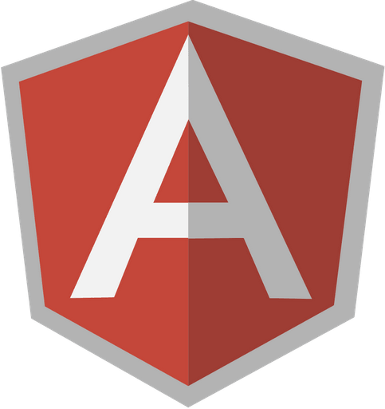

# __BASIC FRONT-END BOILERPLATE__

| PACKAGE.JSON | BOWER.JSON |
| --- | --- |
|  |  |

>This repo contains a simplified boilerplate to start a project with __grunt__, __angular__ and __bootstrap__ in order to make easier and faster the template's developing

Developed following the best practice for Angular.js (https://github.com/johnpapa/angular-styleguide), in anticipation of the arrival of Angular 2

---

## __WHAT THIS SEXY BOILERPLATE CONTAINS__

---

## __SET UP__

Before cloning the repo **be sure** you have installed:

* [NodeJs & npm](http://nodejs.org/download/) (version >= 4.2.2)
* [Grunt](http://gruntjs.com/getting-started) (latest version)
* [Bower](http://bower.io/) (latest version)
* [Sass](http://sass-lang.com/install) (latest version)

- Choose a folder project in your system and switch in `cd [folder path]`
- Clone the repo in your folder `git clone https://github.com/ibbatta/grunt-frontend-boilerplate.git`

---

## __INSTALLATION__

To install the npm repositories and bower packages run (from the directory of the project): `npm install && bower install`

---

## __USAGE__

Once everything is installed, use grunt from the terminal to start the build tasks.
The Gruntfile expose these tasks:

- `npm start` (start the project locally)
- `npm run build` (minify js, html and css files)
- `grunt clean` (clean / remove tmp, dist and bower's component folders)

---

## __TODO__

- Add favicon
- Automate Grunt for images
- Automate Grunt for bootstrap html linter (linter)[https://github.com/twbs/grunt-bootlint]
- Add Karma / Jasmine tests

---

## __CONTRIBUTING__

- Fork it!
- Create your feature branch: `git checkout -b my-new-feature`
- Commit your changes: `git commit -am 'Add some feature'`
- Push to the branch: `git push origin my-new-feature`
- Submit a pull request

---

## __CREDITS__

- [Maurizio Battaghini](https://github.com/ibbatta) (template develop)
- [Aristeidis Bampakos](https://github.com/bampakoa) (tests integration and inspiration)

---

### __TROUBLESHOOTING__ ###

This is just my personal boilerplate, it may or may not be a good fit for your project(s).

---
